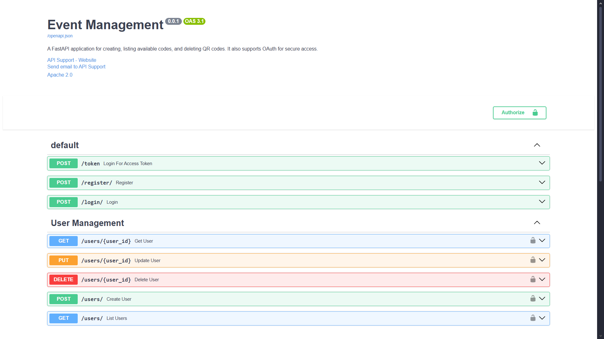
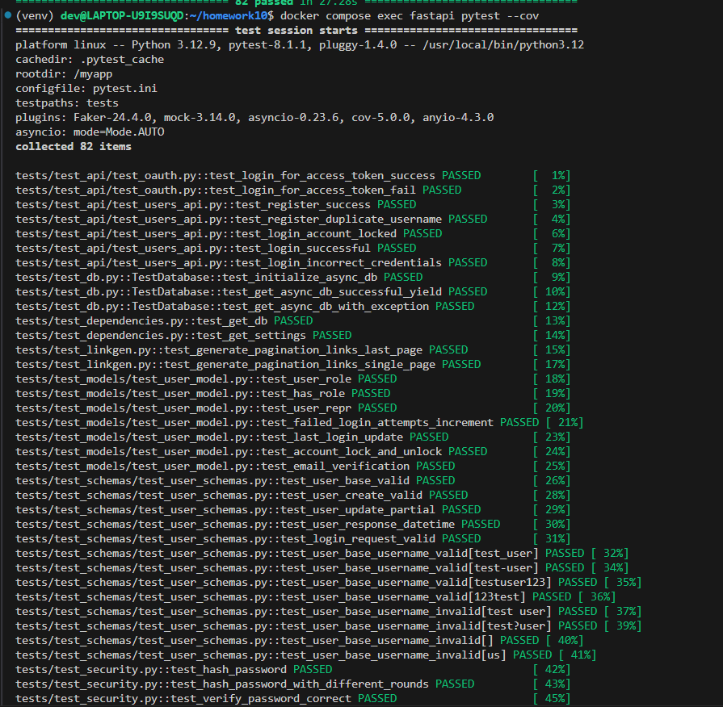
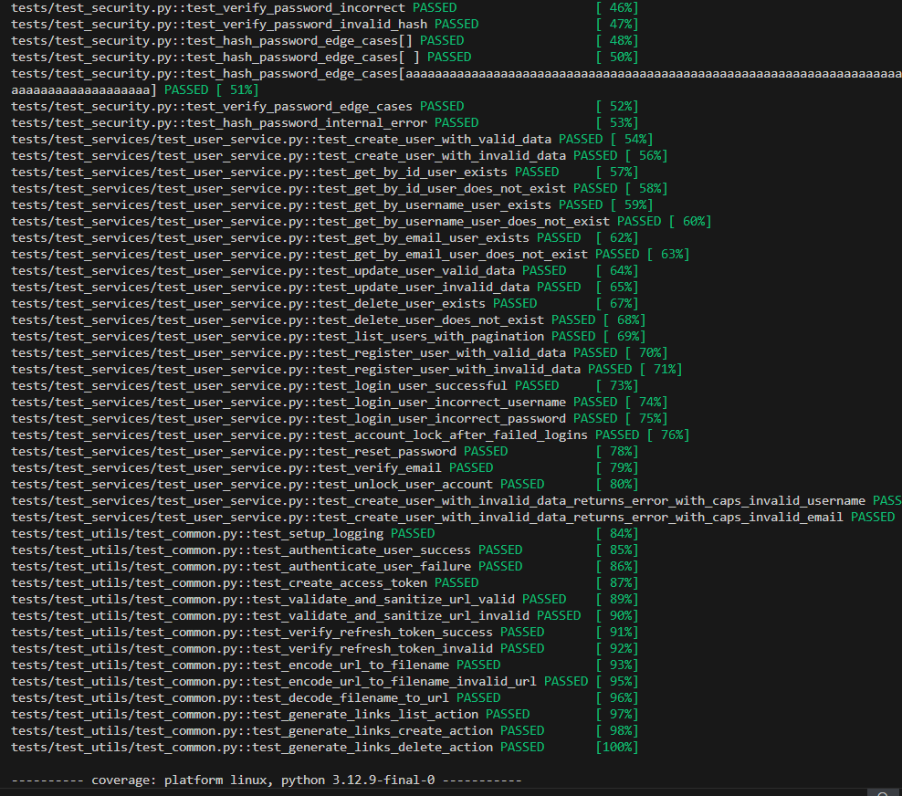
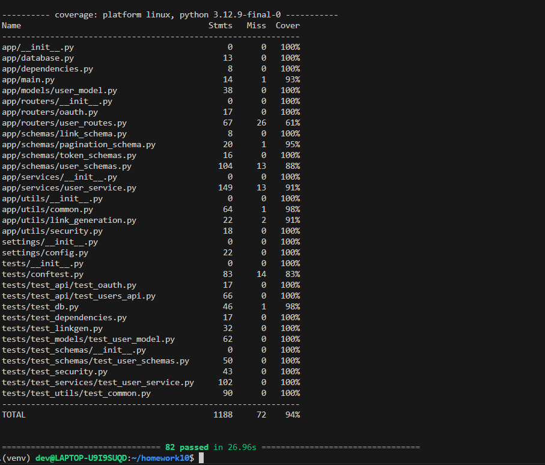

## Event Manager Company: Software QA Analyst/Developer Onboarding Assignment
After setting up and following the steps given in the video, fastapi is up and running.

## Setup and Preliminary Steps
Make sure the github actions and docker hub tokens are updated accordingly and image build is triggered when needed.

## Submission Requirements
The following part as per the grading rubrics:
## Testing and Database Management
Testing the application for test cases - all are up and running with no failures.

Achieved **94%** coverage with different test cases:

## Specific Issues to Address
## All the issues addressed and fixed as per the standards:

1. **Username validation**:
Issue Link: https://github.com/d3v07/homework10/issues/3
PR Link: https://github.com/d3v07/homework10/pull/4

2. **Password validation**:
Issue Link:https://github.com/d3v07/homework10/issues/13
PR Link: https://github.com/d3v07/homework10/pull/14

3. **Profile field edge cases**: 
Issue Link: https://github.com/d3v07/homework10/issues/5
PR Link: https://github.com/d3v07/homework10/pull/7

4. **Issue demonstrated in the instructor video**:
Issue Link: https://github.com/d3v07/homework10/issues/1
PR Link: https://github.com/d3v07/homework10/pull/2

5. **Add normalization to user name**:
Issue Link:https://github.com/d3v07/homework10/issues/6
PR Link: https://github.com/d3v07/homework10/pull/9

6. **Add normalization to email**:
Issue Link:https://github.com/d3v07/homework10/issues/11
PR Link: https://github.com/d3v07/homework10/pull/12

- Links to the closed issues: https://github.com/d3v07/homework10/issues?q=is%3Aissue%20state%3Aclosed
- Link to project image deployed to Dockerhub: https://hub.docker.com/repository/docker/devt444/homework10/general

## Summary
- I gained practical experience in software version control by managing a Git repository, effectively using pull requests (PRs) to track changes and ensure code quality before merging into the main branch. I also deepened my understanding of RESTful API integration for seamless communication between services. This process enhanced automated CI/CD pipelines, where successful builds trigger unit tests and subsequently deploy containerized applications to DockerHub, streamlining deployment and scaling in real-world applications.